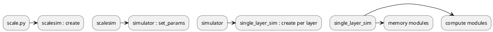

# SCALE-Sim v3 Architecture

This document provides a high-level overview of the main modules in SCALE-Sim v3 and how they interact during a simulation run.

## Module Overview

- **scale.py** – Command line entry point. Parses arguments and instantiates `scalesim`.
- **scale_sim.py** – Top-level controller class. Parses configuration, topology and layout files, then delegates simulation to `simulator`.
- **simulator.py** – Manages simulation of multiple layers. For each layer it creates a `single_layer_sim` instance and coordinates compute and memory steps.
- **single_layer_sim.py** – Handles computation and memory modeling for a single layer. Uses compute and memory modules to generate traces and statistics.
- **compute/** – Contains dataflow-specific compute models (`systolic_compute_os.py`, `systolic_compute_ws.py`, `systolic_compute_is.py`) and utilities to build operand matrices.
- **memory/** – Implements the double-buffered scratchpad memory system along with read/write buffers and ports. Generates SRAM/DRAM traces and stall statistics.
- **scale_config.py** – Parses architecture configuration files and exposes hardware parameters.
- **topology_utils.py** – Reads topology CSV files describing each layer of the workload.
- **layout_utils.py** – Parses optional layout CSVs for modeling custom memory layouts.

Additional features such as sparsity modeling, ramulator integration and energy estimation are configured through the above modules and documented in `README_Sparsity.md`, `README_ramulator.md` and `README_accelergy.md`.

## Simulation Flow

1. `scale.py` parses command line arguments and creates a `scalesim` instance.
2. `scalesim` loads configuration, topology and layout data and sets up a `simulator`.
3. `simulator` iterates through each layer in the topology:
   - Creates a `single_layer_sim` for that layer.
   - Runs compute modeling to build operand demand matrices.
   - Runs memory modeling to service the demands and generate traces.
4. After all layers finish, reports are written in CSV format under the run directory.

## PlantUML Diagram

